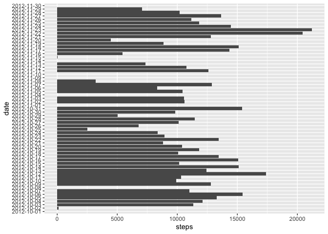
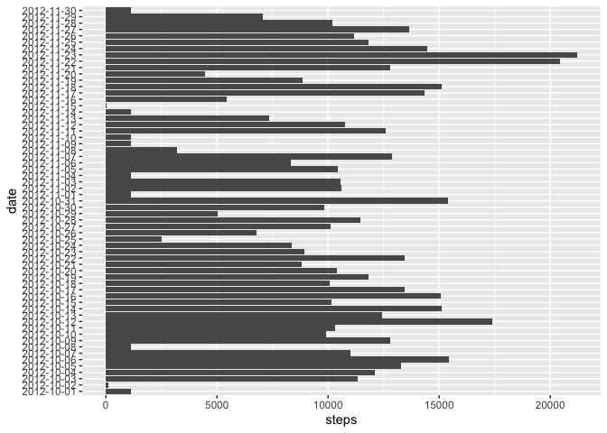
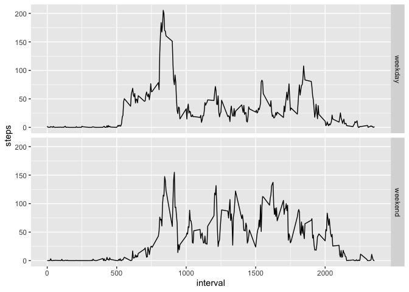

## Loading and preprocessing the data

```r
library(dplyr)
```

```
## 
## Attaching package: 'dplyr'
```

```
## The following objects are masked from 'package:stats':
## 
##     filter, lag
```

```
## The following objects are masked from 'package:base':
## 
##     intersect, setdiff, setequal, union
```

```r
library(ggplot2)

if(!dir.exists("data")) {
  temp = tempfile()
  download.file("https://d396qusza40orc.cloudfront.net/repdata/data/activity.zip", temp)
  unzip(temp, exdir = paste0(getwd(), "/data"))
  unlink(temp)
  rm(temp)
}

data <- read.csv("./data/activity.csv") %>%
        tbl_df()

str(data)
```

```
## tibble [17,568 × 3] (S3: tbl_df/tbl/data.frame)
##  $ steps   : int [1:17568] NA NA NA NA NA NA NA NA NA NA ...
##  $ date    : Factor w/ 61 levels "2012-10-01","2012-10-02",..: 1 1 1 1 1 1 1 1 1 1 ...
##  $ interval: int [1:17568] 0 5 10 15 20 25 30 35 40 45 ...
```


## What is mean total number of steps taken per day?

```r
daily_data <- data %>%
  mutate(date = as.factor(date)) %>% 
  group_by(date) %>% 
  summarise(steps = sum(steps, na.rm = TRUE))

ggplot(daily_data, aes(x=steps, y=date)) + geom_bar(stat = "identity")
```

<!-- -->

```r
mean(daily_data$steps)
```

```
## [1] 9354.23
```

```r
median(daily_data$steps)
```

```
## [1] 10395
```


## What is the average daily activity pattern?

```r
interval_data <- data %>%
  group_by(interval) %>% 
  summarise(steps = mean(steps, na.rm = TRUE))
  
ggplot(interval_data, aes(x=interval, y=steps)) + geom_path()
```

<!-- -->

### Max number of steps interval:

```r
interval_data[interval_data$steps == max(interval_data$steps),]
```

```
## # A tibble: 1 x 2
##   interval steps
##      <int> <dbl>
## 1      835  206.
```

## Imputing missing values

Number of rows with missing values

```r
nrow(data[is.na(data$steps),])
```

```
## [1] 2304
```

New database with missing values equal to median of the represented interval.
I did not use the mean because it does not make sense to have data with decimals
if steps should be integers.

```r
interval_median_data <- data %>%
  group_by(interval) %>% 
  summarise(steps = median(steps, na.rm = TRUE))

data_without_nas <- data %>% 
  mutate(steps = ifelse(is.na(steps), (interval_median_data[interval_median_data$interval == unique(interval),]$steps), steps))

dayly_data_without_nas <- data_without_nas %>% 
  group_by(date) %>% 
  summarise(steps = sum(steps))

ggplot(dayly_data_without_nas, aes(x=steps, y=date)) + geom_bar(stat = "identity")
```

<!-- -->

```r
mean(dayly_data_without_nas$steps)
```

```
## [1] 9503.869
```

```r
median(dayly_data_without_nas$steps)
```

```
## [1] 10395
```

We can see that the mean and the median increased.

## Are there differences in activity patterns between weekdays and weekends?

```r
data_weekend <- data_without_nas %>% 
  mutate(date = as.Date(date), weekpart = ifelse(weekdays(date, abbreviate = TRUE) %in% c("Sat", "Sun"), "weekend", "weekday")) %>%
  group_by(weekpart, interval) %>% 
  summarise(steps = mean(steps))

ggplot(data_weekend, aes(x=interval, y=steps)) + geom_path() + facet_grid(weekpart~.)
```

<!-- -->
